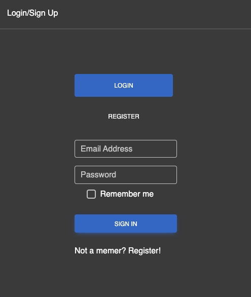
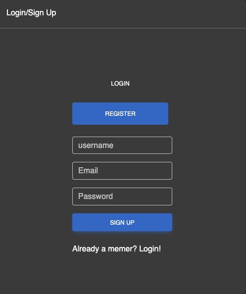
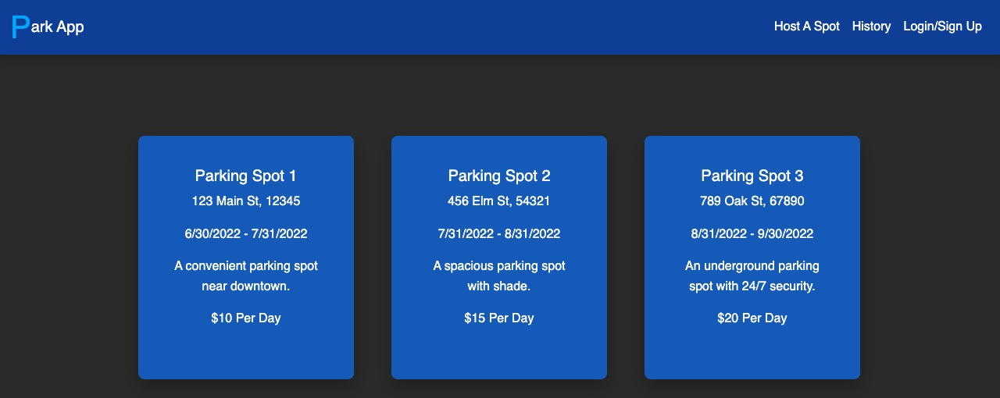
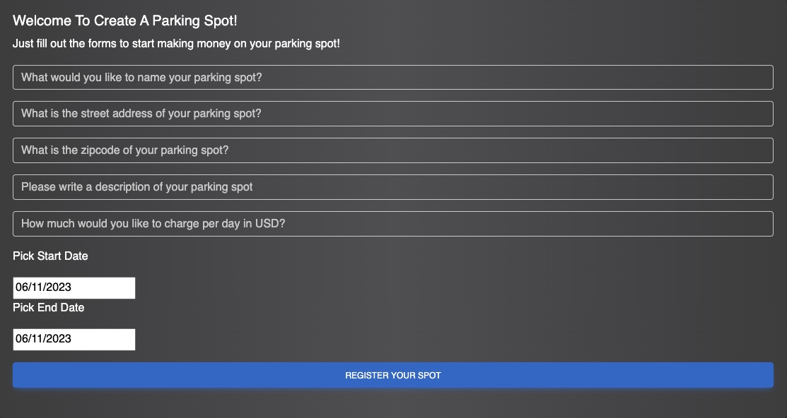
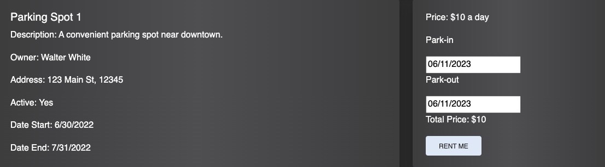

# Park-App

## Overview

[Visit the Deployed Site]( )

ParkApp is a web application that allows users to rent out their parking spots and enables other users to find and rent available parking spots. It functions similarly to Airbnb but for parking spots. Users can list their parking spots for rent, set availability and pricing, and users looking for parking can search for available spots, make reservations, and pay securely through the platform.

------------------

## Table of Contents 

* [User Story](#user-story)
* [Models](#models)
* [Resolvers](#resolvers)
* [React Datepicker](#react-datepicker)
* [MD Bootstrap](#md-bootstrap)
* [Usage](#usage)
* [Learning Objectives](#learning-objectives)
* [Learning Points](#learning-points)
* [Contributors](#contributors)
* [Credits](#credits)
* [License](#license)

--------------

## Technologies Used

| Technology Used         | Resource URL           | 
| ------------- |:-------------:| 
| Framer Motion | [Framer Motion](https://www.framer.com/motion/)     |  
| MongoDB | [MongoDB](https://www.mongodb.com/)     |     
| MD Bootstrap | [MD Bootstrap](https://mdbootstrap.com/)     |     
| Nodemon | [Nodemon](https://www.npmjs.com/package/nodemon)    |     
| Bcrypt | [Bcrypt](https://www.npmjs.com/package/bcrypt)     |     
| Concurrently |[Concurrently](https://www.npmjs.com/package/concurrently )     | 
| Express-Handlebars | [Express-Handlebars](https://www.npmjs.com/package/express-session)     |   
| Express | [Express](https://www.npmjs.com/package/express-handlebars)| 
| dotenv | [dotenv](https://www.npmjs.com/package/dotenv)   |   
| GraphQL | [GraphQL](https://graphql.org/)    |   
| Mongoose | [Mongoose](https://mongoosejs.com/)    |   
| Heroku | [Heroku](https://devcenter.heroku.com/articles/heroku-cli)     |   
| Node.js | [Node.js](https://nodejs.org/en)    |   
| CSS | [CSS](https://developer.mozilla.org/en-US/docs/Web/CSS)         |   
| Excalidraw | [Excalidraw](https://excalidraw.com/)         |   
| HTML | [HTML](https://developer.mozilla.org/en-US/docs/Web/HTML)         |   
| Git | [https://git-scm.com/](https://git-scm.com/)     |  

---------------------

## User Story

As a User I want o see a login or signup form <br/>
So that I can access the site



As a User I want to submit my user info <br/>
So that I can create an account 



As a User I want to be able to view parking spots on this app <br/>
So I can see if I want to rent them



As a User I want to be able to create parking spot <br/>
So I can rent it out to other users



As a User I want to be rent a parking spot I like <br/>
So I can have somewhere to park



As a User I want to be able to view my past parking spots <br/>
So I can see my history


--------------------


## Models

One of the first steps in our project was creating the models. This was so we can set the rules for features such as our parking spots and user information.


How we created our Models for Parking Spots:
```javascript
  const ParkingSpotSchema = new Schema({
  name: {
    type: String,
    trim: true,
    minlength: 1,
    maxlength: 256,
    required: true,
    unique: true,
  },
  description: {
    type: String,
    trim: true,
    minlength: 1,
    maxlength: 256,
  },
  streetAddress: {
    type: String,
    trim: true,
    minlength: 1,
    maxlength: 256,
    required: true,
  },
```

----------------------

## Resolvers
One of our next steps was to set up our resolvers and start creating mutations.


How we used mutations so users can create a profile and create a parking space
```javascript
  Mutation: {
    createUser: async (parent, { username, email, password }) => {
      try {
        console.log("I got called");
        const user = await User.create({ username, email, password });
        console.log("User is: ");
        console.log(user);
        return user;
      } catch (err) {
        console.error(err);
      }

    },
    createParkingSpot: async (
      parent,
      {
        name,
        streetAddress,
        zipcode,
        price,
        dateStart,
        description,
        dateEnd,
        owner,
      }
```

---------------------

## React Datepicker

We used React Datepicker so users easily set the times available rental times or users being able to select what time they want to rent the parking space from.

Below, you will see how we implemented React Date Picker on the client-side. Setting the min date and max date allowed us to make sure Users can only select the dates made available by the owner of the rental spot. We combined this with a calculator function so whatever dates are selected, then appropriate price is displayed since the price is set by day.
```javascript
                  <DatePicker
                    label="Pick Start Date"
                    name="startDate"
                    selected={startDate}
                    onChange={handleStartDateChange}
                    value={startDate}
                    minDate={new Date()}
                    maxDate={startdatemaxdate}
                    required
                  />
                  <p>Park-out</p>
                  <DatePicker
                    name="endDate"
                    label="Pick End Date"
                    selected={endDate}
                    onChange={handleEndDateChange}
                    value={endDate}
                    minDate={enddatemindate}
                    maxDate={enddatemaxdate}
                    required
                  />
                  <p>Total Price: ${calculatePrice()}</p>
                  <MDBBtn
                    color="secondary"
                    type="submit"
                    form="createrentalform"
                  >
```


----------------------

## MD Bootstrap

For our Styling we went with MD Bootstrap as it allowed for super easy use of styling. We opted for MDB's darktheme style sheet which essentially makes our site follow a darktheme.

An example of it can be found below:


MDB also makes it super easy when creating styles such as cards as they components to use will stay in line with the rest of the style sheet.

An example of how we implemented MDB components into this application can be found below:

```js
    <MDBCardBody>
              <MDBCardTitle>{spot.name}</MDBCardTitle>
              <MDBCardText>
                <p>Description: {spot.description}</p>
                <p>Owner: {spot.owner.username}</p>
                <p>
                  Address: {spot.streetAddress}, {spot.zipcode}
                </p>
                <p>Active: {spot.active ? "Yes" : "No"}</p>
                <p>Date Start: {formattedDateStart}</p>
                <p>Date End: {formattedDateEnd}</p>
              </MDBCardText>
            </MDBCardBody>
          </MDBCard>
```


------------------------

## Usage 

Navigate to the site using the link at the top of this README. Once there create an account by clicking on the login/signup button then enter your username, email, a password. After that, if you want add a parking spot to rent, click the Host a Spot button and fill out your parking info. To rent out a spot, click on one that interests you and then select what dates you will be parking there and click the rent me button. To view the past parking spots you've rented out, click on the History button on the nav bar.


--------------------

## Learning Objectives
1. Applying and solidifying programming fundamentals: The project week is an opportunity for students to put into practice the foundational skills they have learned throughout the bootcamp, such as HTML, CSS, and JavaScript.
2. Working in teams: Many project weeks are designed to simulate real-world development scenarios where students work collaboratively in teams to build a web application. Learning how to work with others in a development environment is an important skill for any aspiring web developer.
3. Developing problem-solving skills: Building a web application requires the ability to solve complex problems and troubleshoot issues that arise. Project weeks challenge students to identify and overcome roadblocks and find creative solutions to technical challenges.
4. Using new technologies: Project weeks often introduce students to new technologies or frameworks that they may not have used before. This can be an opportunity to expand their skillset and learn about the latest tools and techniques in web development.
5. Building a portfolio: The web application that students create during project week can be used as a portfolio piece to showcase their skills and experience to potential employers. Learning how to build a polished and functional web application is a valuable asset for any developer.

-------------------

## Learning Points

As a group we learned a lot about React and how to properly set up back-end and front-end components. We were already familiar with creating and using models but got more practice doing this and learning how to about it to typeDefs and Resolvers. We got more familiar with using React Datepicker and how to adapt it to ur needs. All of us got good experience using MD Bootstrap and understanding what works, and what doesn't. 


------------------------

## Contributors

[Daniel Lam](https://github.com/dann-lam) <br />
[Sean Tamturk](https://github.com/seantamturk) <br />
[Sam Higa](https://github.com/samhiga) <br/>

------------------

## Credits

[Custom Scalars](https://www.apollographql.com/docs/apollo-server/schema/custom-scalars/) <br />

------------------

## License
 
[](https://opensource.org/licenses/MIT)

### The MIT License (MIT)
Copyright © 2023 Daniel Lam, Sean Tamturk, Sam Higa

Permission is hereby granted, free of charge, to any person obtaining a copy of this software and associated documentation files (the “Software”), to deal in the Software without restriction, including without limitation the rights to use, copy, modify, merge, publish, distribute, sublicense, and/or sell copies of the Software, and to permit persons to whom the Software is furnished to do so, subject to the following conditions:

The above copyright notice and this permission notice shall be included in all copies or substantial portions of the Software.

THE SOFTWARE IS PROVIDED “AS IS”, WITHOUT WARRANTY OF ANY KIND, EXPRESS OR IMPLIED, INCLUDING BUT NOT LIMITED TO THE WARRANTIES OF MERCHANTABILITY, FITNESS FOR A PARTICULAR PURPOSE AND NONINFRINGEMENT. IN NO EVENT SHALL THE AUTHORS OR COPYRIGHT HOLDERS BE LIABLE FOR ANY CLAIM, DAMAGES OR OTHER LIABILITY, WHETHER IN AN ACTION OF CONTRACT, TORT OR OTHERWISE, ARISING FROM, OUT OF OR IN CONNECTION WITH THE SOFTWARE OR THE USE OR OTHER DEALINGS IN THE SOFTWARE.
